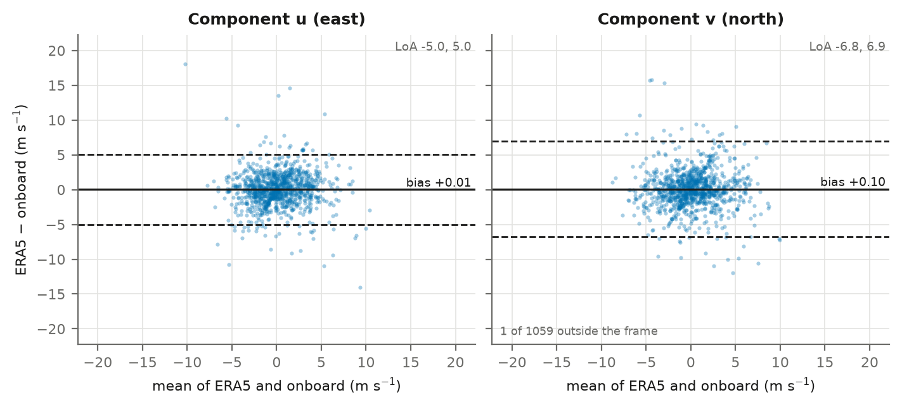
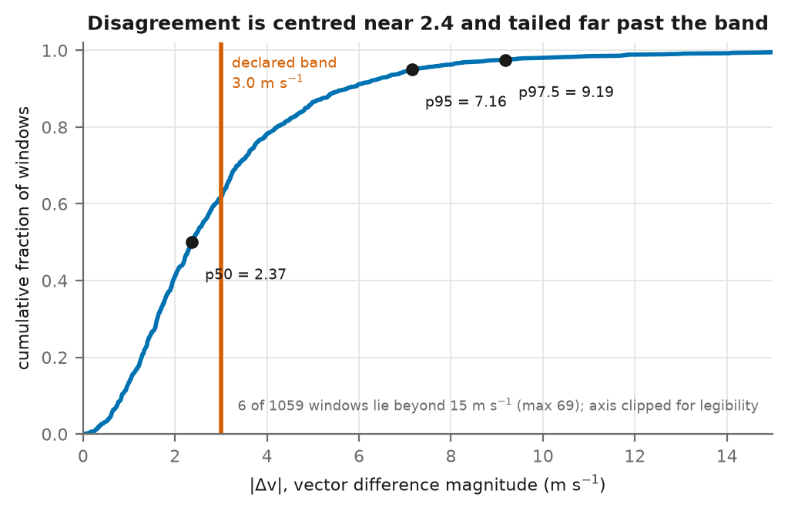
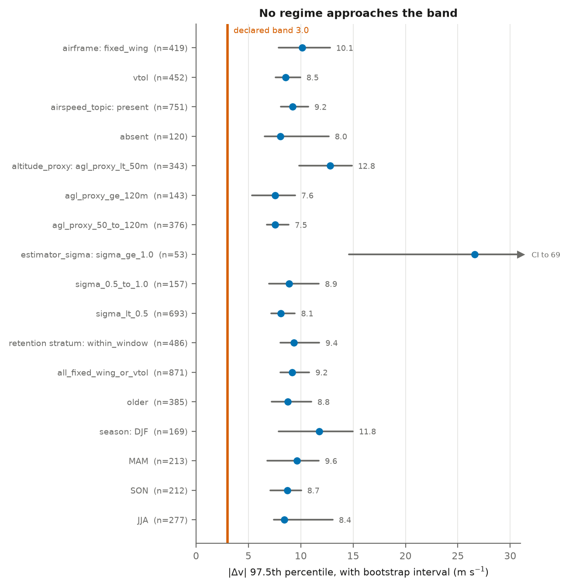
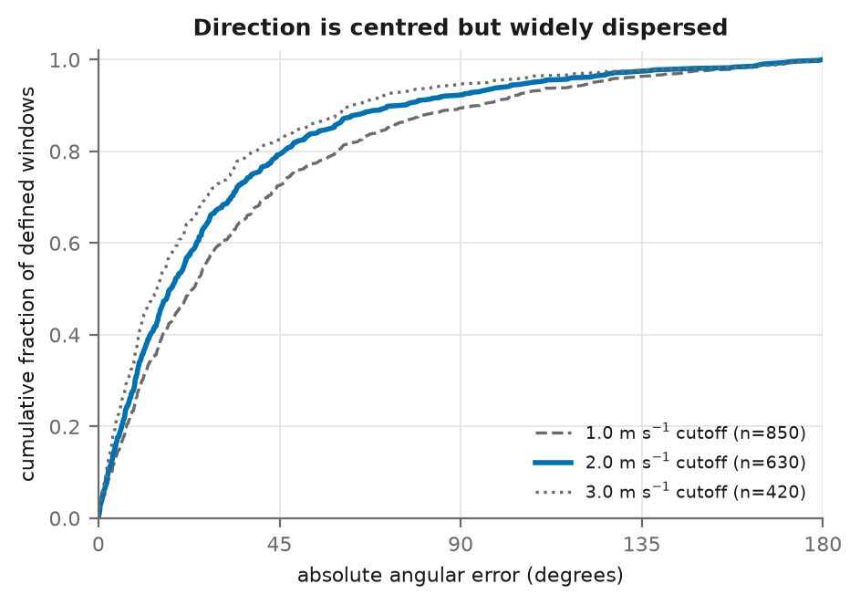
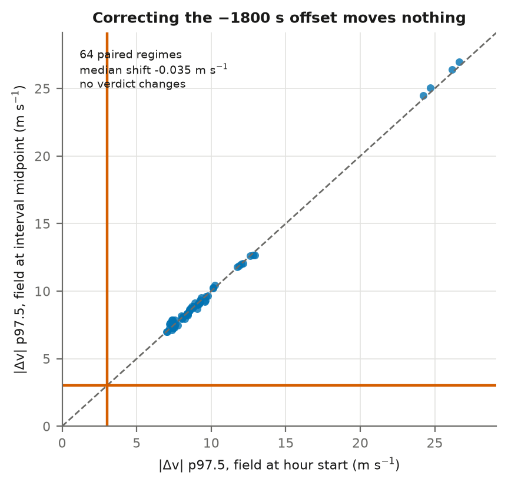

# No detectable offset, far too much spread: reanalysis wind cannot replace onboard UAS wind estimates

**Andrea Bozzo**

*Draft manuscript. Every number is read from the artifacts in
[`../../artifacts/`](../../artifacts/) by `scripts/build_manuscript.py`; none is typed by
hand. Generated from the `v0.1.0` release, archived at
[doi:10.5281/zenodo.22127670](https://doi.org/10.5281/zenodo.22127670).*

## Abstract

Operators and regulators increasingly want to know what conditions an uncrewed flight
actually encountered, and reanalysis is the obvious source when no measurement exists. We
ask whether ERA5 wind can stand in for a UAS's own wind estimate. Using
871 public PX4 fixed-wing and VTOL flights and 1,059
flight-hours paired to ERA5, we compare the reanalysis against the onboard EKF2 estimate as
two uncertain methods rather than treating either as truth. We find **no evidence of a
systematic component-wise offset** — every component bias interval includes zero — but the
disagreement is large: the median vector difference is 2.37 m s⁻¹ and
its 97.5th percentile is 9.19 m s⁻¹, against a usefulness band of
3.0 m s⁻¹ declared before any result existed. No regime among five pre-declared axes
approaches the band. The conclusion survives reweighting, run-level clustering,
grid-distance tolerance, vertical reference, and a full re-pairing with the reanalysis field
interpolated to the centre of each averaging interval, which moves the headline statistic by
a median of -0.032 m s⁻¹. Disagreement grows sharply below 50 m
above launch, consistent with surface-layer heterogeneity a 0.25° field cannot resolve.

## 1. Introduction

External operating context is the missing half of most public flight-telemetry corpora. A
log records what the aircraft did; it rarely records the conditions it did it in, and a
reanalysis product is the cheapest way to supply them retrospectively. The question this
paper answers is narrow and practical: **when a UAS log lacks a usable wind estimate, can
ERA5 be substituted for one?**

Framing matters here. The onboard PX4 wind figure is an EKF2 *estimate* with published
variances, not a measurement, and ERA5 is a 0.25° hourly reanalysis. Neither is ground
truth. We therefore use agreement methods between measurement methods and never regress one
on the other.

## 2. Data

The frame is the public PX4 Flight Review corpus, characterised in full from its published
metadata dump before any download. A stratified sample of 1,600 fixed-wing and VTOL logs was
drawn, 800 from each of two retention strata defined on upload date.

Of those, **871 runs (54.4%)** carry the wind
topic, an absolute time reference and global position. Coverage is recorded rather than
filtered: 623 runs carry no wind topic,
259 no absolute time, and
201 no global position.

Every run with a wind topic also reports its own variance
(1.0 of 977), so the
estimator's self-assessed uncertainty is universally available.

Pairing yields **1,059 windows** from 871 runs;
52 windows were incomplete and are counted, not dropped.
Every window lies within the declared 30 km spatial tolerance — the furthest is
17.82 km — and no ERA5 read failed.

## 3. Method

All decisions below were fixed before any agreement statistic existed, in dated architecture
decision records, and the repository's commit history demonstrates the ordering.

- **Vector, in components.** Bias and limits of agreement on the east and north components
  separately, plus the magnitude of the vector difference. Speed is a secondary scalar.
- **Direction circularly, and only where defined.** Signed angle wrapped to (−180°, 180°],
  reported only where both sources exceed 2.0 m s⁻¹; below that the window is counted as
  undefined.
- **100 m as the declared vertical reference**, with 10 m retained as a secondary.
- **Strata primary, pooled estimates reweighted.** Design weights are the inverse inclusion
  probability `N_h / n_drawn_h`.
- **Bootstrap by run, within stratum**, 2,000 resamples.
- **A declared usefulness band of 3.0 m s⁻¹**, sized against manufacturer wind limits of
  roughly 10–12 m s⁻¹ and asserted rather than cited.

Three estimators were corrected *after* the result was first computed, and are recorded as
post-hoc: the pooled weight, the summary of the non-negative magnitude, and the circular
dispersion measure. No threshold was changed. See ADR-0016.

The design weight uses the drawn count, not the usable count. A usable run's inclusion
probability does not depend on how many other runs proved usable; dividing by the usable
count would target the pre-usability frame. The implied usable population is
**8,809 runs**, 57.3% in the older stratum.

## 4. Results

### 4.1 No detectable offset

| Regime | Runs | Windows | Bias u | 95% CI | Bias v | 95% CI |
|---|---:|---:|---:|---|---:|---|
| older | 385 | 468 | +0.151 | [-0.094, +0.403] | +0.021 | [-0.261, +0.299] |
| within_window | 486 | 591 | -0.096 | [-0.326, +0.138] | +0.156 | [-0.145, +0.513] |
| pooled | 871 | 1059 | +0.013 | [-0.157, +0.192] | +0.096 | [-0.117, +0.329] |

Every interval includes zero. This is a failure to reject a zero offset, not a demonstration
that the offset is zero; no equivalence test was performed, and the intervals remain
compatible with offsets of a few tenths of a metre per second.

### 4.2 The disagreement is large

Pooled at 100 m: median **2.37**, 95th percentile
**7.16**, 97.5th percentile **9.19** m s⁻¹, with a
bootstrap interval on the last of [8.05,
10.82]. The reweighted pooled figure is
9.11. At 10 m the figure is 8.42, slightly
*better* than the 100 m reference declared primary.

The magnitude is non-negative and right-skewed, so it is summarised by empirical quantiles;
mean ± 1.96 SD returns an impossible negative lower limit on this sample. Six of
1,059 windows exceed 15 m s⁻¹ and one reaches 69 — an onboard estimate of
66 m s⁻¹, which is a filter failure rather than a wind. Removing the worst six moves the
97.5th percentile to 8.47, so the result rests on the body of the distribution.

### 4.3 No operational regime rescues it

Five pre-declared axes were cut. The best-agreeing cell is
agl_proxy_50_to_120m at 7.53 m s⁻¹, still 2.5× the
band.

**Altitude separates most interpretably.** Below 50 m above launch the 97.5th percentile is
**12.79** [9.85, 14.88],
against 7.53 [6.75,
8.85] between 50 and 120 m and 7.55 above
120 m; the first two intervals do not overlap. This is *consistent with* the greater
roughness, heterogeneity and shear expected near the surface, which a 0.25° field at 100 m
cannot resolve. It is not evidence that altitude causes it: this is an observational sample,
the altitude is a takeoff-relative proxy, terrain is unmodelled, and mission profile and
airframe co-vary with height.

**Estimator uncertainty separates more strongly and means less.** Where the filter reports
σ below 0.5 m s⁻¹ the 97.5th percentile is 8.09; at σ ≥ 1.0 it is
26.62. The gradient is partly circular by construction — a noisy
estimate disagrees more with anything — so it locates where the comparison is least
informative rather than where the reanalysis is worst.

Airframe, airspeed topic and season show overlapping intervals throughout.

### 4.4 Direction is centred but widely dispersed

At the declared cutoff, 630 of 1,059 windows have a defined
direction and **429 (40.5%)
do not**. Among those defined, the circular mean error is
-3.7° with resultant length 0.770,
median absolute error 18.0° and 90th percentile
74.7°.

### 4.5 Robustness

| Check | Effect on the headline |
|---|---|
| Reweighting to the frame | 9.19 → 9.11 |
| One window per run | 9.188 → 9.226 |
| Vertical reference 100 m → 10 m | 9.19 → 8.42 |
| Join tolerance 30 km → 10 km | verdict unchanged at every cap |
| Time alignment corrected | median -0.032, range [-0.371, +0.479], **0 verdict changes** |

The temporal check is the strongest of these. The primary comparison places an instantaneous
field at the start of the hour the onboard estimate is averaged over. Re-pairing the entire
corpus with the field interpolated to the interval midpoint changes every value — median
0.183 m s⁻¹ — and changes no conclusion.

## 5. Limitations

Public PX4 logs are an observational convenience sample selected on uploader intent: an
upload is public only when its author filed a flight report and chose to publish it. No
figure here generalises to a production fleet.

The 3.0 m s⁻¹ band is asserted, not cited. It was fixed before any result existed, which
establishes it was not chosen to fit one; it does not make it authoritative. Nothing turns on
its exact value — the pooled 95th percentile is 7.16 m s⁻¹.

Three declared axes are uncut: firmware version, which the sampling frame does not carry, and
topography and true altitude AGL, which need a terrain model this work does not build.
Geography is not stratified at all. Three further axes are represented only by proxies: an
airspeed *topic* rather than a sensor, a reported variance band rather than the estimator's
mechanism, and height above launch rather than AGL — the rangefinder that would give AGL is
valid for a median 0.4% of rows and reads at touchdown.

Disagreement does not identify which source is wrong. Neither is ground truth.

## 6. Conclusion

ERA5 wind shows no detectable systematic offset against onboard PX4 EKF2 wind estimates and
disagrees with them far too widely to substitute for them, in every regime tested. For
practitioners the operational reading is direct: a reanalysis value is not a replacement for
a missing onboard wind estimate at the tolerance a flight-limit check requires, and it is
least adequate close to the ground, where most of the risk is.

Reporting where a proxy fails is a result. The pipeline, schemas, decision records and
aggregate artifacts are published so the failure can be checked rather than believed.

## Data and code availability

Pipeline, schemas, decision records and aggregate artifacts:
<https://github.com/AndreaBozzo/occas>, archived at
[doi:10.5281/zenodo.22127670](https://doi.org/10.5281/zenodo.22127670) — the `v0.1.0` release this manuscript is
generated from. The concept DOI [10.5281/zenodo.22127669](https://doi.org/10.5281/zenodo.22127669) resolves to the
latest version.

Raw geolocated trajectories are not redistributed; the source logs remain public at PX4
Flight Review. Every number above traces to an `AnalysisManifest` under
`artifacts/manifests/`.
